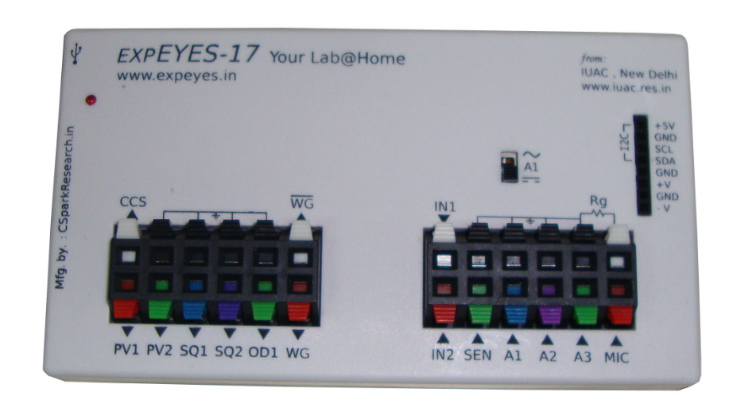

# Get started with ExpeyesRVCE
Note: This code is based off of [Expeyes website](http://expeyes.in) and is under GNU GPL licence. The code in this repo is open to modifications.

## How to install expeyes on an Ubuntu based Linux Distribution?

1. Open the terminal by pressing Win+T
2. Copy paste the following commands
```
cd ~/Downloads
wget https://raw.githubusercontent.com/shashankholla/expeyesRVCE/master/install-expeyes.sh
sudo bash ./install-expeyes.sh
```


Please be patient as this will take some time. Once all commands are executed, you can now find ExpEYES-RVCE logo in the launcher.


## How to use Expeyes-RVCE?

Step1: Click on the expeyesRVCE logo in the launcher.

If you can’t find the expeyesRVCE logo in your launcher, press Win+T to open the terminal and type the following commands
```
python3 ~/Documents/expeyes/expeyesRVCE-master/main.py
```

Step2: Now you should see the expeyes window open. And you should, by default, be in the NPN Characteristics window.


Step3: Read the guide for the experiement by checking the ‘Enable Pop up help window’.
Remember that not all experiements have instructions guides. 


Step4: Make the circuit connections as told. Then connect the expeyes device to your computer’s USB port using the data cable and follow the instructions to perform the experiment.


Information: If you happen to receive a ‘Error. Try Device->Reconnect’ message, it means either your device isn’t properly connected to your computer or the drivers for Expeyes are missing.


Try clicking the Device option on the top left corner and click the Reconnect submenu.
Now, try performing the experiement again.
# **The equipment**

-   ExpEYES-17 is interfaced and powered by the USB port of the computer, and it is programmable in Python.
    
-   It can function as a low frequency oscilloscope, function generator, programmable voltage source, frequency counter and data logger.
    
-   The software can monitor and control the voltages at these terminals. In order to measure other parameters (like temperature, pressure etc.), we need to convert them in to electrical signals by using appropriate sensor elements.
    
-   The device can be also used as a test equipment for electrical and electronics engineering experiments.
    

> #### NOTE: The external voltages connected to ExpEYES17 must be within the allowed limits. Inputs A1 and A2 must be with +/-16 volts range and Inputs IN1 and IN2 must be in 0 to 3.3V range. Exceeding these limits may result in damage to the equipment. To measure higher voltages, scale them down using resistive potential divider networks.

## 1.1.External Connections



**Constant Current Source (CCS) :**

The constant current source can be switched ON and OFF under software control.

The nominal value is 1.1 mA but may vary from unit to unit, due to component tolerances. To measure the exact value, connect an ammeter from CCS to GND. Another method is to connect a known resistance (~1k) and measure the voltage drop across it. The load resistor should be less than 3k for this current source.

**Programmable Voltage (PV1) :**

Can be set, from software, to any value in the -5V to +5V range. The resolution is 12 bits, implies a minimum voltage step of around 2.5 millivolts.

**Programmable Voltage (PV2) :**

Can be set, from software, to any value in the -3.3V to +3.3V range. The resolution

is 12 bits.

**Square Wave SQ1:**

Output swings from 0 to 5 volts and frequency can be varied 4Hz to 100kHz. All intermediate values of frequency are not possible.

**Square Wave SQ2:**  
Output swings from 0 to 5 volts and frequency can be varied 4Hz to 100kHz. All intermediate values  
of frequency are not possible. The duty cycle of the output is programmable. SQR2 is not available when WG is active.  
**Digital Output (OD1) :**  
The voltage at OD1 can be set to 0 or 5 volts, using software.

**Sine/Triangular Wave WG:**  
Frequency can be varied from 5Hz to 5kHz. The peak value of the amplitude can be set to  
3 volts, 1.0 volt or 80 mV. Shape of the output waveform is programmable. Using the GUI sine or triangular can be selected. WG bar is inverted WG.

## **Inputs:**

**Capacitance meter IN1:**  
Capacitance connected between IN1 and Ground can be measured. It works better for lower  
capacitance values, upto 10 nanoFarads, results may not be very accurate beyond that.

**Frequency Counter IN2:**  
Capable of measuring frequencies upto several MHz.

**Resistive Sensor Input (SEN):**  
This is mainly meant for sensors like Light Dependent Resistor, Thermistor, Photo-transistor etc. SEN is internally connected to 3.3 volts through a 5.1kΩ resistor.

**±16V Analog Inputs, A1 & A2:** Can measure voltage within the ±16 volts range. The input voltage range can be selected from .5V to 16V fullscale. Voltage at these terminals can be displayed as a function of time, giving the functionality of a low frequency oscilloscope. The maximum sampling rate is 1 Msps /channel. Both have an input impedance of 1MOhm

**±3.3V Analog Input A3:**  
Can measure voltage within the ± 3.3 volts range. The input can be amplified by connecting a resistor from Rg to Ground, gain = 1 + Rg/10000. This enables displaying very small amplitude signals. The input impedance of A3 is 10MOhm.

**Microphone input MIC:** This enables displaying very small amplitude signals. The input impedance

**I2C Sensor Interface:**  
The four connections (+5V, Ground, SCL and SDA) of the 8 terminal berg strip supports I2C sensors.  
The software is capable of recognizing a large number of commercially available I2C sensors.

**±6V /10mA Power supply:**  
The VR+ and VR- are regulated power outputs. They can supply very little current, but good enough to power an Op-Amp.

